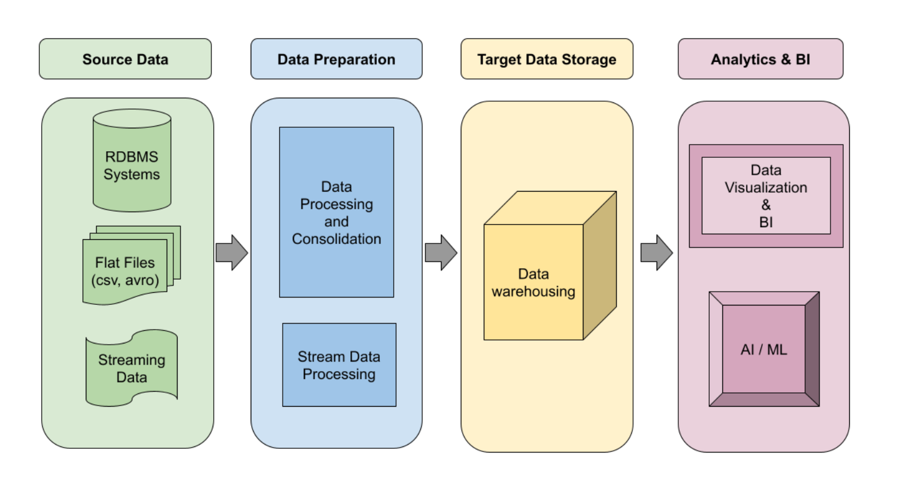
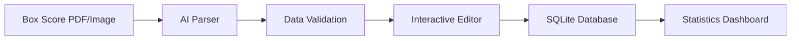

### Data Pipeline Overview

This section outlines the logic and workflow for the data pipeline used in this project.

#### **Pipeline Components**

1. **Source Data**: Raw PDF files containing box scores at the end of a game.
2. **Data Preparation**: Extract key information from PDFs into a structured format and perform validation.
3. **Data Storage**: Store processed data in an SQLite database.
4. **Data Access**: Provide an API to stream the data for further use.
5. **Visualization**: Use a Streamlit UI to preview the workflow and interact with the data.

---

### **Workflow: From Raw PDF to SQLite Database**

#### **1. Input: Raw Box Score PDFs**

- Box score data is provided in PDF format at the end of each game.
- These PDFs serve as the source data for the pipeline.

#### **2. Parsing the PDFs**

- The pipeline extracts key information, including:
  - **Player Box Scores**: Points, assists, rebounds, etc., for each player.
  - **Team Box Scores**: Aggregated statistics for the team.
- Extracted data is validated for accuracy and completeness.

#### **3. Storing the Data**

- Validated data is stored in an SQLite database.
- The schema supports both player-level and team-level statistics.

#### **4. Previewing the Data**

- A Streamlit UI previews the workflow and allows interaction with stored data.
- Features include:
  - Viewing player and team statistics.
  - Searching and filtering data for specific games or players.

---

### **Key Benefits**

- **Automation**: Eliminates manual data entry by automating extraction.
- **Validation**: Ensures data is accurate and reliable.
- **Accessibility**: Provides an easy-to-use interface for data interaction.

This pipeline streamlines the process of transforming raw game data into actionable insights.

---

### 📈 Usage Workflow

1. Upload box score file (PDF or image).
2. Select the game to add statistics to.
3. Parse to extract data using AI.
4. Review and edit the extracted data.
5. Save validated data to the database.
6. View updated statistics and standings.

---

### 🐛 Troubleshooting

**Common Issues**

**"Invalid API key"**

- Check your `.env` file for the correct OpenAI API key.
- Ensure there are no extra spaces or quotes.

**"Player/Team ID not found"**

- The database may need initialization with teams/players.
- Check `print_database_contents()` output.

**Poor parsing accuracy**

- Ensure image quality is good (clear, well-lit).
- PDF text should be selectable, not scanned images.
